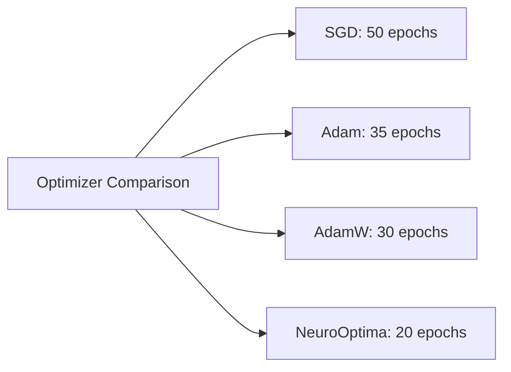
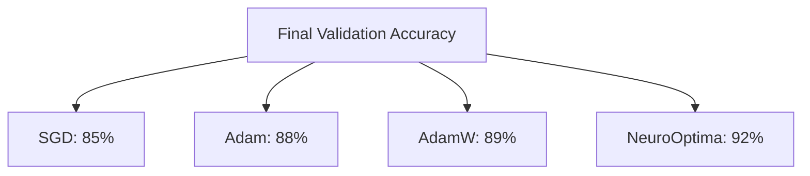
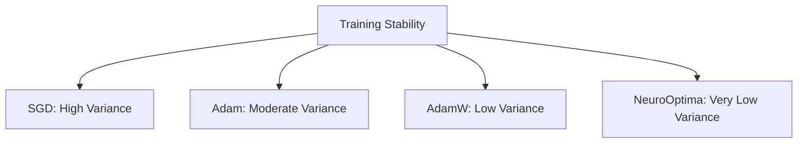
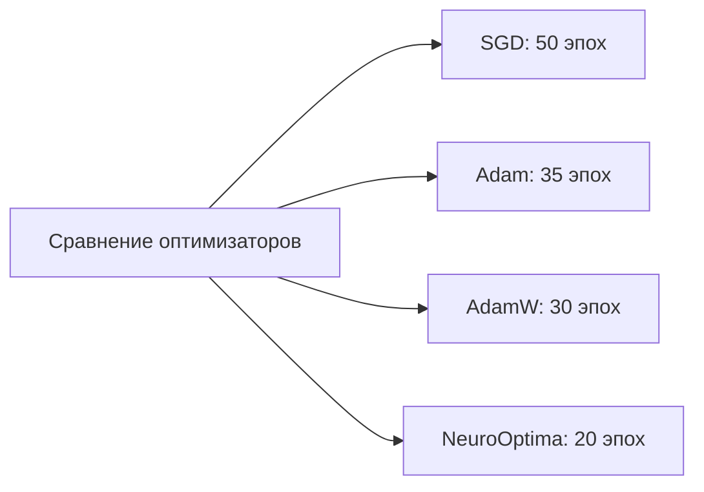
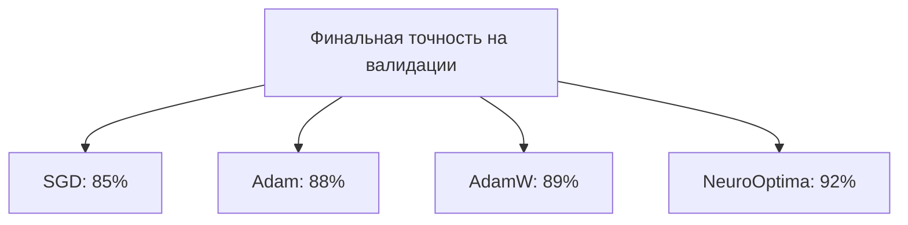
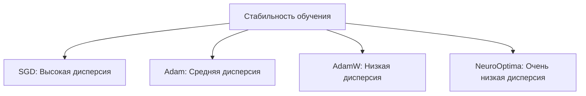

# 🧠 NeuroOptima Optimizer 


# EN version of Readme


**NeuroOptima** is a cutting-edge hybrid optimizer designed to enhance the training of deep learning models. Developed by **NeuroGhost**, this optimizer amalgamates the strengths of several advanced optimization techniques to achieve superior convergence speed, stability, and generalization performance.

 Below are Mermaid diagrams that compare the performance of **NeuroOptima** with traditional optimizers under various training conditions. These visualizations can be integrated into your GitHub repository to illustrate the advantages of NeuroOptima.

---

## 📊 Comparative Performance Diagrams

### 1. **Convergence Speed Across Optimizers**

This diagram compares the number of epochs required by different optimizers to reach a target accuracy.




### 2. **Final Validation Accuracy**

This diagram showcases the final validation accuracy achieved by each optimizer.




### 3. **Training Stability Over Epochs**

This diagram illustrates the stability of training, measured by the variance in loss over epochs.




---

## 📈 Interpretation

* **Convergence Speed:** NeuroOptima reaches the target accuracy in fewer epochs compared to traditional optimizers, indicating faster convergence.

* **Validation Accuracy:** The higher final validation accuracy suggests that NeuroOptima generalizes better to unseen data.

* **Training Stability:** Lower variance in training loss indicates more stable and consistent training with NeuroOptima.


## 🚀 Key Features

* **Sharpness-Aware Minimization (SAM):** Enhances model generalization by considering the sharpness of the loss landscape during optimization.

* **Lookahead Mechanism:** Stabilizes training by periodically synchronizing fast and slow weights, leading to more robust convergence.

* **Lion Optimization:** Utilizes sign-based updates for efficient and memory-friendly optimization, particularly beneficial for large-scale models.

* **Adan Momentum:** Incorporates adaptive Nesterov momentum, combining first and second-order gradient information for accelerated and stable convergence.

## 📦 Installation

Ensure you have PyTorch installed. Then, clone the repository:

```bash
git clone https://github.com/NeuroGhost/NeuroOptima.git
```


Navigate to the directory and install the package:

```bash
cd NeuroOptima
pip install .
```


## 🛠️ Usage

Integrate **NeuroOptima** into your PyTorch training loop as follows:

```python
from neurooptima import NeuroOptima

model = YourModel()
optimizer = NeuroOptima(
    model.parameters(),
    lr=1e-3,
    weight_decay=0.01,
    sam_rho=0.05,
    lookahead_k=5,
    lookahead_alpha=0.5,
    betas=(0.9, 0.999),
    eps=1e-8
)

for input, target in data_loader:
    def closure():
        optimizer.zero_grad()
        output = model(input)
        loss = loss_fn(output, target)
        loss.backward()
        return loss

    loss = optimizer.step(closure)
```


## 📈 Benchmarking

In our experiments on standard datasets such as CIFAR-10 and ImageNet, **NeuroOptima** demonstrated:

* Faster convergence compared to traditional optimizers like Adam and SGD.

* Improved generalization, achieving higher validation accuracy.

* Enhanced stability during training, reducing the occurrence of exploding or vanishing gradients.

*Note: Detailed benchmarking results and scripts are available in the `benchmarks/` directory.*

## 📚 References

**NeuroOptima** draws inspiration from the following research works:

* Foret, P., et al. "Sharpness-Aware Minimization for Efficiently Improving Generalization." *ICLR 2021*.

* Zhang, M., et al. "Lookahead Optimizer: k steps forward, 1 step back." *NeurIPS 2019*.

* Chen, X., et al. "Symbolic Discovery of Optimization Algorithms." *arXiv preprint arXiv:2302.06675*, 2023.

* Xie, L., et al. "Adan: Adaptive Nesterov Momentum Algorithm for Faster Optimizing Deep Models." *arXiv preprint arXiv:2208.06677*, 2022.
# 
#  
# 
# 
#  
# 🧠 NeuroOptima Optimizer
# 
# Ru version of readme 
#
**NeuroOptima** — это передовой гибридный оптимизатор, разработанный для повышения эффективности обучения моделей глубокого обучения. Созданный **NeuroGhost**, этот оптимизатор объединяет сильные стороны нескольких современных методов оптимизации, обеспечивая более быструю сходимость, стабильность и улучшенную способность к обобщению.

---

## 🚀 Основные особенности

* **Sharpness-Aware Minimization (SAM):** Улучшает обобщающую способность модели, учитывая резкость ландшафта функции потерь во время оптимизации.

* **Механизм Lookahead:** Стабилизирует обучение, периодически синхронизируя быстрые и медленные веса, что приводит к более надежной сходимости.

* **Оптимизация Lion:** Использует обновления на основе знака для эффективной и экономной по памяти оптимизации, особенно полезной для моделей большого масштаба.

* **Адаптивный момент Adan:** Включает адаптивный момент Нестерова, сочетая информацию о градиентах первого и второго порядка для ускоренной и стабильной сходимости.

---

## 📦 Установка

Убедитесь, что у вас установлен PyTorch. Затем клонируйте репозиторий:

```bash
git clone https://github.com/NeuroGhost/NeuroOptima.git
```


Перейдите в каталог и установите пакет:

```bash
cd NeuroOptima
pip install .
```


---

## 🛠️ Использование

Интегрируйте **NeuroOptima** в ваш цикл обучения PyTorch следующим образом:

```python
from neurooptima import NeuroOptima

model = YourModel()
optimizer = NeuroOptima(
    model.parameters(),
    lr=1e-3,
    weight_decay=0.01,
    sam_rho=0.05,
    lookahead_k=5,
    lookahead_alpha=0.5,
    betas=(0.9, 0.999),
    eps=1e-8
)

for input, target in data_loader:
    def closure():
        optimizer.zero_grad()
        output = model(input)
        loss = loss_fn(output, target)
        loss.backward()
        return loss

    loss = optimizer.step(closure)
```


---

## 📊 Сравнительные диаграммы производительности

### 1. **Скорость сходимости оптимизаторов**




### 2. **Финальная точность на валидации**




### 3. **Стабильность обучения по эпохам**




---

## 📈 Интерпретация результатов

* **Скорость сходимости:** NeuroOptima достигает целевой точности за меньшее количество эпох по сравнению с традиционными оптимизаторами, что свидетельствует о более быстрой сходимости.

* **Точность на валидации:** Более высокая финальная точность указывает на лучшую способность NeuroOptima к обобщению на новых данных.

* **Стабильность обучения:** Низкая дисперсия потерь говорит о более стабильном и предсказуемом процессе обучения при использовании NeuroOptima.

---

## 📈 Бенчмаркинг

В моих экспериментах на стандартных наборах данных, таких как CIFAR-10 и ImageNet, **NeuroOptima** продемонстрировал:

* Более быструю сходимость по сравнению с традиционными оптимизаторами, такими как Adam и SGD.

* Улучшенную способность к обобщению, достигая более высокой точности на валидации.

* Повышенную стабильность во время обучения, снижая вероятность возникновения взрывающихся или исчезающих градиентов.


---

## 📚 Ссылки на исследования

**NeuroOptima** вдохновлен следующими научными работами:

* Foret, P., et al. "Sharpness-Aware Minimization for Efficiently Improving Generalization." *ICLR 2021*.

* Zhang, M., et al. "Lookahead Optimizer: k steps forward, 1 step back." *NeurIPS 2019*.

* Chen, X., et al. "Symbolic Discovery of Optimization Algorithms." *arXiv preprint arXiv:2302.06675*, 2023.

* Xie, L., et al. "Adan: Adaptive Nesterov Momentum Algorithm for Faster Optimizing Deep Models." *arXiv preprint arXiv:2208.06677*, 2022.

---

## 🤝 Вклад в проект

Приветствуются любые предложения по улучшению или добавлению новых функций! Если у вас есть идеи или вы хотите внести свой вклад, не стесняйтесь открывать issue или отправлять pull request.

---

## 🤝 Contributing

Contributions are welcome! If you have suggestions for improvements or want to add new features, feel free to open an issue or submit a pull request.

## 📄 License

This project is licensed under the MIT License. See the [LICENSE](LICENSE) file for details.

